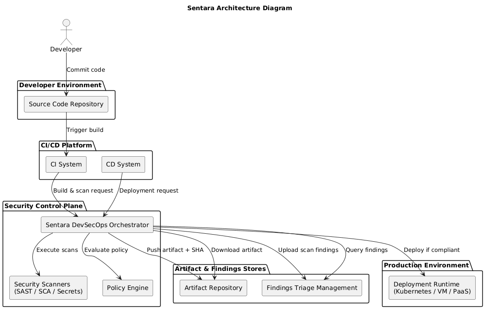

# Sentara DevSecOps Orchestration Suite
**Sentara DevSecOps** is an automated governance framework designed to enforce security policy and cryptographic integrity across the software development lifecycle (SDLC). By decoupling security logic from traditional CI/CD pipelines, Sentara provides a Zero Trust mechanism for the build and deployment of critical software infrastructure.

## 🛡️ Core Value Proposition
In alignment with U.S. Executive Order 14028 and NIST SP 800-218 (SSDF), this suite mitigates Software Supply Chain risks by ensuring:

<details>
<summary><b>▶ Click to expand High-Resolution System Architecture</b></summary>
<br>

<div align="center">
  
</div>

</details>

1. **Cryptographic Chain of Custody**: Every binary is uniquely identified by its SHA-256 hash.
2. **Autonomic Governance**: Deployment decisions are made programmatically based on real-time security posture data from DefectDojo.
3. **Integrity Enforcement**: A "Hardened Wrapper" prevents the execution of tampered or un-vetted artifacts on production systems.

## 🏗️ System Architecture
The suite consists of two primary orchestrators that create a "Golden Thread" of trust:
1. **Build Orchestrator (Sentara-build)**: Executes SAST/SCA scans, generates a SHA-256 hash, and pushes metadata to DefectDojo using Tag-Inheritance to ensure findings are linked to the specific build.
    
2. **Deployment Orchestrator (Sentara-deploy)**: Downloads the artifact, re-verifies the hash, and queries DefectDojo for the specific build-tag. If vulnerabilities exist above the threshold, the gate terminates.
    
    
### 🚀 Prerequisites & Setup
1. **DefectDojo**: A running instance with product configured(e.g., demo.defectdojo.org).
2. **Artifactory**: A repository named sentara-builds(eg., nexus, Jfrog, & etc).
3. **Docker**: Required to run the hardened orchestrator image.

### 💻 Local Installation
1. Clone the repository
    * git clone https://github.com/Sentara-OSS/Sentara-DevSecOps-Orchestrator.git
2. Build the docker image
    ```powershell
    docker build -t sentara-orchestrator:v1.0.0 .
    ```

### 🛠️ Usage Examples 
1. **Orchestrate a Secure Build**
Run this from your source code directory. This command interrogates the code, uploads the artifact to Artifactory, and pushes the scan results to DefectDojo with a unique hash-tag. 

> **Reference Application:** [Sentinel-Demo-App](https://github.com/Sentara-OSS/Sentara-Demo-App.git)
> Use this repository to test the build and deploy orchestrator functionality.
```powershell
docker run --rm -it `
  -v "${CURRENT_WORKSPACE}:/src_to_scan" `
  -e ARTIFACTORY_REPO_URL="http://host.docker.internal:8081/repository/sentara-builds/" `
  -e ARTIFACTORY_USER="admin" `
  -e ARTIFACTORY_PASS="admin" `
  -e DEFECT_DOJO_URL="https://demo.defectdojo.org/api/v2" `
  -e DEFECT_DOJO_TOKEN="548afd6fab3bea9794a41b31da0e9404f733e222" `
  -e DEFECT_DOJO_PRODUCT="Sentara-Demo" `
  -e DEFECT_DOJO_PRODUCT_TYPE="Sentara-Automated-Scans" `
  sentara-orchestrator:v1.0.0 `
  sentara-build `
    --repo-path "/src_to_scan" `
    --build-command "python setup.py sdist" `
    --artifact-path "/src_to_scan/dist/sentara_demo-0.1.tar.gz" `
    --project-name "sentara-demo" `
    --version "0.1"
```

<details>
<summary><b>▶ Click to expand Build & Attestation Logs</b></summary> 

<pre>
C:\Workspace\Sentara-Demo-App> docker run --rm -it `
>>   -v "${CURRENT_WORKSPACE}:/src_to_scan" `
>>   -e ARTIFACTORY_REPO_URL="http://host.docker.internal:8081/repository/sentara-builds/" `
>>   -e ARTIFACTORY_USER="admin" `
>>   -e ARTIFACTORY_PASS="admin" `
>>   -e DEFECT_DOJO_URL="https://demo.defectdojo.org/api/v2" `      
>>   -e DEFECT_DOJO_TOKEN="548afd6fab3bea9794a41b31da0e9404f733e222" `
>>   -e DEFECT_DOJO_PRODUCT="Sentara-Demo" `
>>   -e DEFECT_DOJO_PRODUCT_TYPE="Sentara-Automated-Scans" `
>>   sentara-orchestrator:v1.0.0 `
>>   sentara-build `
>>     --repo-path "/src_to_scan" `
>>     --build-command "python setup.py sdist" `
>>     --artifact-path "/src_to_scan/dist/sentara_demo-0.1.tar.gz" `
>>     --project-name "sentara-demo" `
>>     --version "0.1"
[INFO] --- Senatara Orchestrator Started ---
[INFO] Executing Build Command: 'python setup.py sdist'

[06:12:46] [INFO] Launching Security Task: python setup.py sdist
  > running sdist
  > running egg_info
  > writing sentara_demo.egg-info/PKG-INFO
  > writing dependency_links to sentara_demo.egg-info/dependency_links.txt
  > writing requirements to sentara_demo.egg-info/requires.txt
  > writing top-level names to sentara_demo.egg-info/top_level.txt
  > reading manifest file 'sentara_demo.egg-info/SOURCES.txt'
  > writing manifest file 'sentara_demo.egg-info/SOURCES.txt'
  > running check
  > creating sentara_demo-0.1
  > creating sentara_demo-0.1/sentara_demo.egg-info
  > copying files to sentara_demo-0.1...
  > copying README.md -> sentara_demo-0.1
  > copying app.py -> sentara_demo-0.1
  > copying setup.py -> sentara_demo-0.1
  > copying sentara_demo.egg-info/PKG-INFO -> sentara_demo-0.1/sentara_demo.egg-info
  > copying sentara_demo.egg-info/SOURCES.txt -> sentara_demo-0.1/sentara_demo.egg-info
  > copying sentara_demo.egg-info/dependency_links.txt -> sentara_demo-0.1/sentara_demo.egg-info
  > copying sentara_demo.egg-info/requires.txt -> sentara_demo-0.1/sentara_demo.egg-info
  > copying sentara_demo.egg-info/top_level.txt -> sentara_demo-0.1/sentara_demo.egg-info
  > copying sentara_demo.egg-info/SOURCES.txt -> sentara_demo-0.1/sentara_demo.egg-info
  > Writing sentara_demo-0.1/setup.cfg
  > Creating tar archive
  > removing 'sentara_demo-0.1' (and everything under it)
[06:12:47] [SUCCESS] Task Passed.
[INFO] 🔍 Extracting SCM and Artifact metadata...

[06:12:47] [INFO] Launching Security Task: git config --global --add safe.directory /src_to_scan
[06:12:47] [SUCCESS] Task Passed.
[INFO] Running SAST (Semgrep)...

-----------------------------------------------------------------
                          SAST ANALYSIS
-----------------------------------------------------------------


[06:12:47] [INFO] Launching Security Task: semgrep scan . --config auto --json -o "/app/reports/sast_report.json"
  > 
  > 
  > ┌─────────────┐
  > │ Scan Status │
  > └─────────────┘
  > Scanning 4 files tracked by git with 1063 Code rules:
  > 
  > Language      Rules   Files          Origin      Rules
  > ─────────────────────────────        ───────────────────
  > <multilang>      48       4          Community    1063
  > python          243       2
  >
  > 
  >
  > ┌──────────────┐
  > │ Scan Summary │
  > └──────────────┘
  > ✅ Scan completed successfully.
  > • Findings: 3 (3 blocking)
  > • Rules run: 291
  > • Targets scanned: 4
  > • Parsed lines: ~100.0%
  > • Scan was limited to files tracked by git
  > • For a detailed list of skipped files and lines, run semgrep with the --verbose flag
  > Ran 291 rules on 4 files: 3 findings.
  > 
  > A new version of Semgrep is available. See https://semgrep.dev/docs/upgrading
[06:12:55] [SUCCESS] Task Passed.
[INFO] Running SCA/SBOM (Syft)...

-----------------------------------------------------------------
                        SCA/SBOM ANALYSIS
-----------------------------------------------------------------


[06:12:55] [INFO] Launching Security Task: syft dir:. -o cyclonedx-json --file "/app/reports/sbom.json"
  > Flag --file has been deprecated, use: output
[06:12:56] [SUCCESS] Task Passed.
[INFO] Running Vulnerability Analysis (Grype)...

-----------------------------------------------------------------
                     VULNERABILITY ANALYSIS
-----------------------------------------------------------------


[06:12:56] [INFO] Launching Security Task: grype sbom:"/app/reports/sbom.json" -o json > "/app/reports/vulnerability_report.json"
[06:14:48] [SUCCESS] Task Passed.
[INFO] Running Secret Detection...

-----------------------------------------------------------------
                         SECRET ANALYSIS
-----------------------------------------------------------------


[06:14:48] [INFO] Launching Security Task: detect-secrets scan . --all-files > "/app/reports/secrets_report.json"
[06:14:49] [SUCCESS] Task Passed.
[INFO] 🚀 Starting Artifactory Upload process...
[INFO] 📦 Uploading sentara_demo-0.1.tar.gz to Artifactory...
[INFO] 📦 Uploading sbom.json to Artifactory...
[INFO] 🚀 Starting DefectDojo Sync...
[INFO] 📤 Pushing Anchore Grype to DefectDojo...
[INFO] 📤 Pushing Semgrep JSON Report to DefectDojo...
[INFO] 📤 Pushing Detect-secrets Scan to DefectDojo...
[SUCCESS] --- Senatara Pipeline Finished Successfully ---
</pre>

</details>

2. **Orchestrate a Secure Deployment (The Gate)**
This command queries the security findings specifically for the generated artifact. It will Fail the Gate if any Medium or higher vulnerabilities are detected.
```powershell
docker run --rm -it `
-e ARTIFACTORY_REPO_URL="http://host.docker.internal:8081/repository/sentara-builds/" `
-e ARTIFACTORY_USER="admin" `
-e ARTIFACTORY_PASS="admin" `
-e DEFECT_DOJO_URL="https://demo.defectdojo.org/api/v2" `
-e DEFECT_DOJO_TOKEN="548afd6fab3bea9794a41b31da0e9404f733e222" `
-e DEFECT_DOJO_PRODUCT="Sentara-Demo" `
-e DEFECT_DOJO_PRODUCT_TYPE="Sentara-Automated-Scans" `
sentara-orchestrator:v1.0.0 `
sentara-deploy `
--product "sentara-demo" `
--version "0.1" `
--severity "Medium" `
--artifact-name "sentara_demo-0.1.tar.gz"
```

### ⚠️ Governance Enforcement Results
When the sentara-deploy gate executes, it evaluates the artifact's metadata against the defined policy.

#### Example: Policy Violation (Gate Failure): If the artifact contains vulnerabilities above the --severity threshold, the orchestrator terminates the deployment:

<details>
<summary><b>▶ Click to expand Gate Failure Evidence (Policy Violation)</b></summary>

<pre>
C:\Workspace\Sentara-Demo-App> docker run --rm -it `
>> -e ARTIFACTORY_REPO_URL="http://host.docker.internal:8081/repository/sentara-builds/" `
>> -e ARTIFACTORY_USER="admin" `
>> -e ARTIFACTORY_PASS="admin" `
>> -e DEFECT_DOJO_URL="https://demo.defectdojo.org/api/v2" `
>> -e DEFECT_DOJO_TOKEN="548afd6fab3bea9794a41b31da0e9404f733e222" `
>> -e DEFECT_DOJO_PRODUCT="Sentara-Demo" `
>> -e DEFECT_DOJO_PRODUCT_TYPE="Sentara-Automated-Scans" `
>> sentara-orchestrator:v1.0.0 `
>> sentara-deploy `
>> --product "sentara-demo" `
>> --version "0.1" `
>> --severity "Low" `   
>> --artifact-name "sentara_demo-0.1.tar.gz"
📡 Downloading sentara_demo-0.1.tar.gz from Artifactory...
✅ Download Complete. Verified Hash: 015e4539f900d6e6ad1c52475524dce60e7ddf7152b7e631a15916feed4495d0
🛡️  Gating policy: Finding any Critical, High, Medium, Low issues...
   ⚠️ Found 6 High vulnerabilities.
   ⚠️ Found 9 Medium vulnerabilities.
🛑 GATE FAILED: 15 total violations found.
🛑 GATE FAILED: Security violations found. Aborting deployment.
</pre>

</details>

#### Example: Policy Compliance (Gate Success): If the artifact is "Clean" or does not contain any Critical Vulnerabilities:

<details>
<summary><b>▶Click to expand Gate Success Evidence (Policy Compliance)</b></summary>

<pre>
docker run --rm -it `
>> -e ARTIFACTORY_REPO_URL="http://host.docker.internal:8081/repository/sentara-builds/" `
>> -e ARTIFACTORY_USER="admin" `
>> -e ARTIFACTORY_PASS="admin" `  
>> -e DEFECT_DOJO_URL="https://demo.defectdojo.org/api/v2" `
>> -e DEFECT_DOJO_TOKEN="548afd6fab3bea9794a41b31da0e9404f733e222" `
>> -e DEFECT_DOJO_PRODUCT="Sentara-Demo" `
>> -e DEFECT_DOJO_PRODUCT_TYPE="Sentara-Automated-Scans" `
>> sentara-orchestrator:v1.0.0 `
>> sentara-deploy `
>> --product "sentara-demo" `
>> --version "0.1" `
>> --severity "Critical" `
>> --artifact-name "sentara_demo-0.1.tar.gz"
📡 Downloading sentara_demo-0.1.tar.gz from Artifactory...
✅ Download Complete. Verified Hash: 015e4539f900d6e6ad1c52475524dce60e7ddf7152b7e631a15916feed4495d0
🛡️  Gating policy: Finding any Critical issues...
🟢 GATE PASSED: Artifact meets security policy. Proceeding to deployment
📄 Security Manifest created: ./deploy_staging/sentara_demo-0.1.tar.gz.json
📦 Artifact verified and staged at: ./deploy_staging/sentara_demo-0.1.tar.gz
ℹ️  No deploy command provided. Hand-off complete.
</pre>

</details>


### 📜 Technical Innovation Highlights

| Feature | Technical Innovation | National Security Alignment |
| :--- | :--- | :--- |
| **Severity Cascading** | Automated risk-based decision engine that enforces hierarchical security gates. | **NIST 800-53** (Risk Assessment) |
| **Cryptographic Attestation** | Implementation of SHA-256 "Security Passports" for every software artifact. | **EO 14028** (Integrity) |
| **Zero Trust Wrapper** | A secure execution environment that prevents "Identity Gap" attacks at runtime. | **Zero Trust Architecture** |
| **Universal Orchestrator** | A vendor-neutral security proxy that decouples policy from specific CI/CD tools. | **Interoperability Standards** |


#### Author: Gopal Reddy, Pagidimari

#### Field of Endeavor: Cybersecurity / DevSecOps Infrastructure Security
